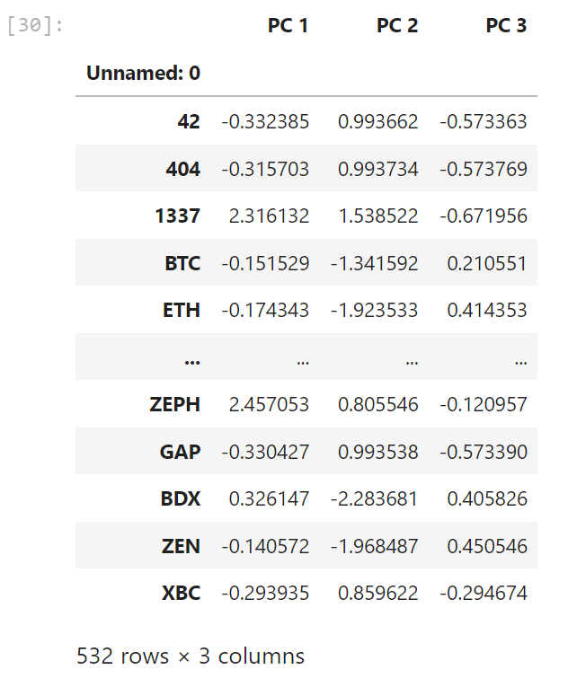
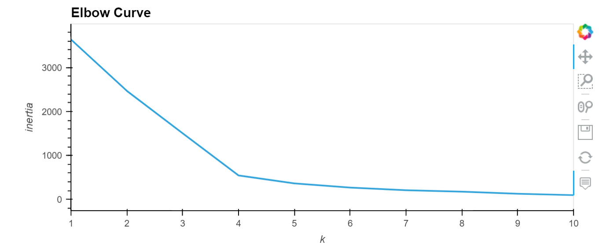
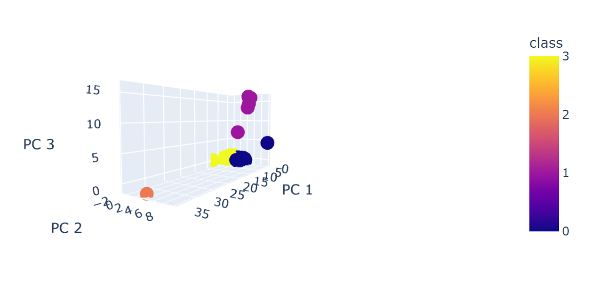

# Cryptocurrencies

## Project Overview

The objective of this project is to create an Unsupervised Machine Learning model. This is completed over the course of 4 Deliverables: 
* Preprocessing
* Principle Component Analysis
* K-means Analysis
* Create a 3D scatter plot model and hvplot.table to review the data

## Deliverable 1

### Preprocessing File:

Here we preprocess the data for Machine learning analysis.

[crypto_clustering.ipynb](./crypto_clustering.ipynb)

## Deliverable 2

### Principle Component Analysis:

With the PCA done, it reduced the the dimensions of the X DataFrame to 3 principal components.

## Deliverable 3

### K-means Analysis

Use an Elbow curve to find the best value for the K-means analysis.

I also made a DataFrame for the crypto data that we exported to a csv file.

[crypto_clustered.csv](./crypto_clustered.csv)

## Deliverable 4

### 3D Scatter Plot and hvplot.table

Lastly I created a 3D scatter plot model and an hvplot.table to review the data.

[hvlplot_table](./Resources/hvplot_table.html)

This is the completed code for the project:

[crypto_clustering_PCA.ipynb](./crypto_clustering_PCA.ipynb)